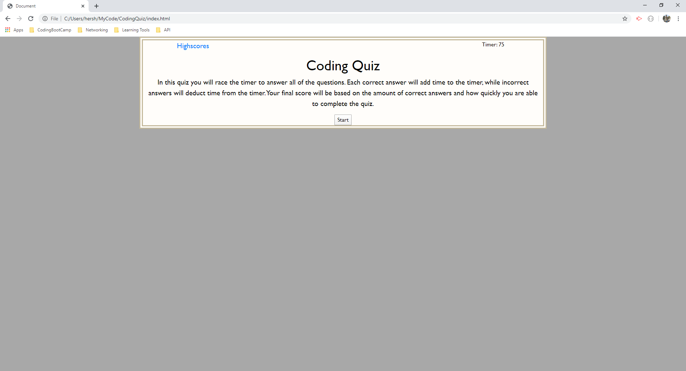
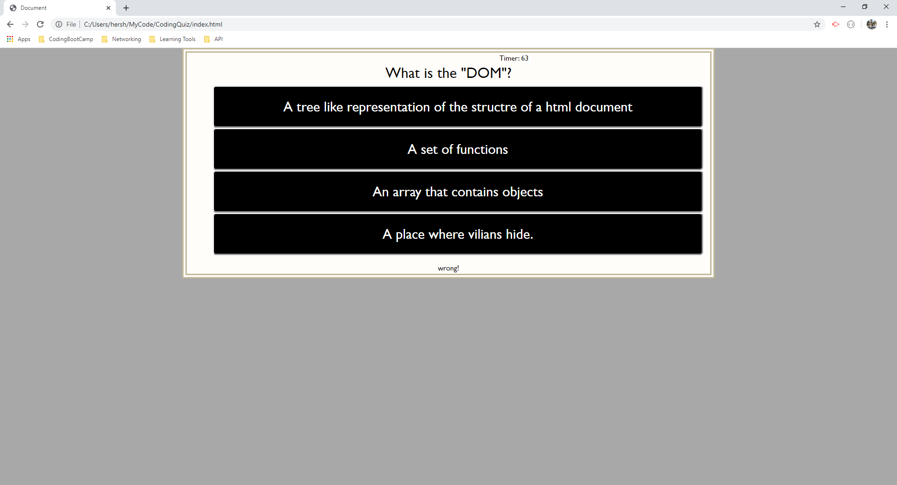

# CodingQuiz
This coding quiz consists of eight questions related to Html, CSS, and JavaScript. The quiz starts with an explination of the quiz and its rules. There is a link to highscores and a timer in the top right. When the user presses start the quiz will begin and the starting elements will hide and new elements will be shown containing multiple choice questions. When the timer reaches 0 the quiz will end, the quiz will also end once all questions are answered. The user is then show their final score and can enter their initials into the highscore page. Once the submit button is pressed the user is directed to the highscores page. There they can go back to the start page or clear the highscores.

